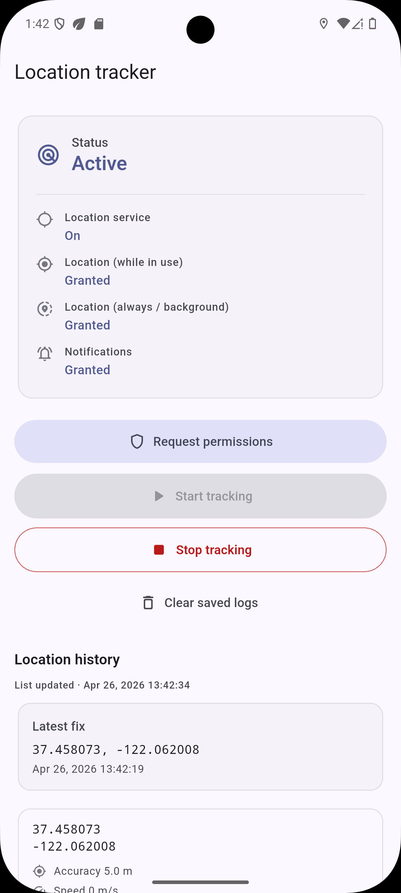
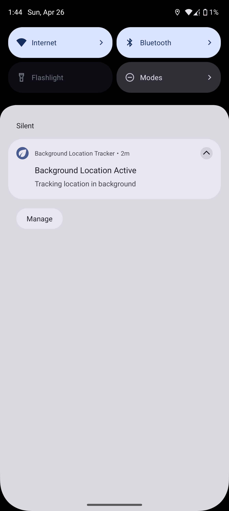

# Flutter Background Location Tracker

Flutter application built for a Software Developer technical assessment: continuous location sampling with Android foreground service support, persisted history, and iOS project configuration for location background mode. **Primary validation:** Android background tracking was exercised on both emulator and physical devices.

---

## Overview

The app lets the user grant location and (on Android) notification permissions, start a background-capable tracking session, and view a scrollable list of saved coordinates with accuracy metadata. Samples are written from the background worker isolate and surfaced in the UI via service events and `SharedPreferences` reloads.

---

## 📸 App Screenshots

<p align="center">
  <br/>
  <em>Main tracking dashboard</em>
</p>

<p align="center">
  <br/>
  <em>Background tracking with foreground service notification</em>
</p>

---

## Features

- Foreground and background location permission flows (platform-appropriate)
- Android notification permission request (API 33+)
- Start / stop tracking with persistent notification while active on Android
- High-accuracy position stream with emulator-friendly settings (`distanceFilter: 0`)
- Local persistence (JSON in `SharedPreferences`), capped at 100 records
- De-duplication of near-duplicate fixes to reduce log noise
- Pull-to-refresh and lifecycle refresh when returning to the app
- Clear saved logs

---

## 🧰 Tech Stack

- Flutter
- geolocator
- flutter_background_service
- permission_handler
- SharedPreferences

Chosen for simplicity, reliability, and cross-platform compatibility.

---

## Architecture & Project Structure

```
lib/
├── main.dart                 # Binding init, background service configure, runApp
├── app.dart                  # MaterialApp, theme, HomeScreen
├── models/
│   └── location_record.dart  # Immutable record + JSON serde
├── screens/
│   └── home_screen.dart      # Permissions, tracking controls, list UI
└── services/
    ├── background_service_manager.dart  # flutter_background_service setup + onStart entrypoint
    ├── location_tracking_service.dart   # Geolocator position stream
    ├── location_storage_service.dart    # Dedupe, save/load/clear
    └── permission_service.dart        # permission_handler + Geolocator service check
```

**Data flow:** `BackgroundServiceManager.onStart` runs in a background isolate, constructs `LocationTrackingService` → each `Position` becomes a `LocationRecord` → `LocationStorageService.saveRecord` persists → `service.invoke('locationUpdate', …)` notifies the main isolate; `HomeScreen` listens and reloads records.

---

## Key Services & Components

| Component | Responsibility |
|---|---|
| `BackgroundServiceManager` | Configures `flutter_background_service`, manages start/stop, and hosts the background entrypoint. |
| `LocationTrackingService` | Subscribes to `Geolocator.getPositionStream`, maps positions to records, and forwards updates. |
| `LocationStorageService` | Saves/loads records, reloads `SharedPreferences`, deduplicates, and keeps the newest 100 entries. |
| `PermissionService` | Handles location service checks and location/notification permissions. |
| `HomeScreen` | Provides permission UX, tracking controls, event listening, and log display. |

---

## Android Implementation

### Foreground service

- `flutter_background_service` is configured with **`isForegroundMode: true`** and an initial notification (title/content and notification id `1001`).
- In `onStart`, the Android service instance calls **`setAsForegroundService()`** and **`setForegroundNotificationInfo`** so the ongoing notification matches the active session.
- `AndroidManifest.xml` registers the plugin’s **`BackgroundService`** with **`android:foregroundServiceType="location"`**.

### Background location permission

- Manifest includes **`ACCESS_BACKGROUND_LOCATION`** alongside fine/coarse location.
- Runtime flow uses **`Permission.locationAlways`** after foreground location, aligned with Android 10+ staged permission expectations.

### Notification permission

- **`POST_NOTIFICATIONS`** is declared in the manifest.
- Runtime: **`Permission.notification.request()`** so foreground service notifications can post on Android 13+.

### Manifest permissions (summary)

- `ACCESS_FINE_LOCATION`, `ACCESS_COARSE_LOCATION`, `ACCESS_BACKGROUND_LOCATION`
- `FOREGROUND_SERVICE`, `FOREGROUND_SERVICE_LOCATION`
- `POST_NOTIFICATIONS`

---

## iOS Implementation

### Info.plist keys

- **`NSLocationWhenInUseUsageDescription`** — explains in-use location.
- **`NSLocationAlwaysAndWhenInUseUsageDescription`** — explains always / background use copy for the permission dialog context.

### `UIBackgroundModes`

- **`location`** is listed under **`UIBackgroundModes`** so the binary declares background location capability.

### Background behavior (limitations)

iOS does **not** guarantee uninterrupted tracking the way a dedicated Android foreground service can. The system may **suspend** the app, **throttle** updates, or require the user to choose **“Always”** location access for meaningful background continuity. **This assessment focused on Android validation**; the iOS target includes the plist and background mode wiring expected for a location app, but **end-to-end background behavior on iOS was not a test claim here**. Developers should validate on real hardware with realistic motion and review current Apple guidelines for always-on location.

---

## How to Run

Prerequisites: Flutter SDK compatible with **`sdk: ^3.11.5`** (see `pubspec.yaml`), Xcode for iOS, Android SDK for Android.

```bash
flutter pub get
flutter run
```

Select an Android emulator/device or iOS simulator/device when prompted.

> **Note:** Hot reload does not reliably apply changes to background service entrypoints or native service wiring. After editing service or manifest/plist logic, use a **full restart** (stop and re-run, or cold start) when validating tracking behavior.

---

## Android Testing (Emulator & Physical Device)

1. **Install** via `flutter run` on the target (AVD or USB device with developer options / USB debugging as needed).
2. **Grant permissions:** tap **Request Location Permissions**; accept **While in use**, then **Allow all the time** (or equivalent) when prompted; allow **notifications** if asked.
3. **Enable location** in system settings if disabled; for emulator, set a mock route or single point in extended controls.
4. **Start tracking** — confirm the **foreground notification** appears and stays while tracking.
5. **Background the app** (home gesture); wait for updates. Return to the app or pull to refresh — list should grow subject to motion and dedupe rules.
6. **Stop** — notification should end and stream should stop.
7. **Physical device:** repeat with GPS on; walk or drive short distances to exceed dedupe thresholds if expecting new rows.

Android background tracking was **tested on both emulator and a physical Android device** for this assessment.

---

## Technical Challenges Addressed

1. **Background service lifecycle** — Service configured once at startup; `onStart` promotes Android to foreground, subscribes to `stopService`, cancels the position stream and **`stopSelf()`** on stop. Initialization path stops a stale running instance to avoid ambiguous state during development.

2. **Background isolate / plugin handling** — `WidgetsFlutterBinding.ensureInitialized()` in `onStart` so plugins (e.g. Geolocator, SharedPreferences) work in the background isolate; entrypoint marked with **`@pragma('vm:entry-point')`** for tree-shaking safety.

3. **`SharedPreferences` across isolates** — Writes occur in the background isolate; reads in the UI call **`prefs.reload()`** inside `getRecords()` so the main isolate does not serve a stale in-memory cache.

4. **Duplicate location filtering** — Before insert, new fixes are compared to recent entries using time windows and **Haversine** distance (with a stricter same-second/nearby rule) to suppress redundant stream emissions.

---

## Future Improvements

- Configurable accuracy, distance filter, and update interval for production vs. demo modes
- Battery-aware presets and user-visible tracking status/errors
- Structured logging or export (CSV/JSON) of the history
- Unit tests for dedupe and storage edge cases; integration tests for permission gating
- iOS-specific QA pass on device with documented “Always” location UX and App Store–compliant copy

---

*Built for a Teleperformance Software Developer technical assessment.*
